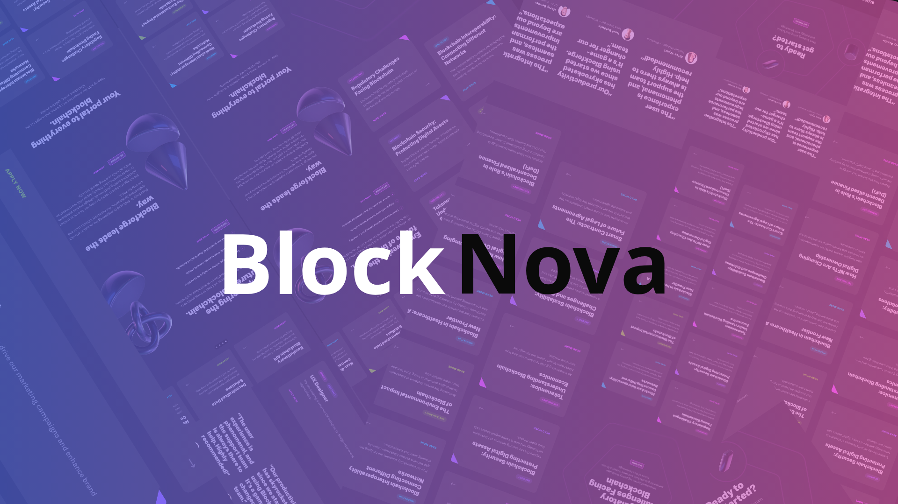

# BlockNova – Astro.js



```BlockNova``` is a fully animated, dark-mode SaaS website built using Astro.js, TailwindCSS, and Framer Motion, featuring a sleek blockchain-inspired design. The project focuses on high performance, modern UI/UX, and professional-grade front-end development.

> The name **BlockNova** combines **"Block"** (from blockchain and block-based design systems) with **"Nova"** (meaning a sudden burst of brightness — like a new star). It reflects both the tech theme and the modern, bold design philosophy.
---
## Tech Stack

| Category             | Tech                                                                                   |
| -------------------- | -------------------------------------------------------------------------------------- |
| **Framework**        | [Astro](https://astro.build/)                                                          |
| **Language**         | [JavaScript](https://developer.mozilla.org/en-US/docs/Web/JavaScript)                  |
| **Styling**          | [Tailwind CSS](https://tailwindcss.com/)                                               |
| **Animation**        | [Framer Motion](https://www.framer.com/motion/)                                        |
| **UI Components**    | [React](https://reactjs.org/) via `@astrojs/react`                                     |
| **Build Tool**       | [Vite](https://vitejs.dev/)                                                            |
| **Linting**          | [ESLint](https://eslint.org/)                                                          |
| **Code Formatting**  | [Prettier](https://prettier.io/)                                                       |
| **Containerization** | [Docker](https://www.docker.com/)                                                      |
| **Hosting**          | [Vercel](https://vercel.com/) |
---

## Getting Started

### 1. Clone the repository

```bash
git clone https://github.com/AymaneMehdi/BlockNova.git
cd BlockNova
```

### 2. Install dependencies

```powershell
npm install
```

### 3. Run the development server

```powershell
npm run dev
```

Then visit : http://localhost:4321

---

## Project Structure
```
.
├── .vscode/
├── public/  
├── src/
│   ├── components/
│   ├── layouts/
│   ├── pages/
│   ├── sections/
│   └── styles/
│   └── content/
├── .dockerignore
├── .gitignore
├── .prettierrc
├── astro.config.mjs
├── DOCKER-README.md
├── Dockerfile
├── eslint.config.js
├── package-lock.json
├── package.json
├── postcss.config.js
├── README.md
├── SECURITY.md
├── LICENSE
├── setup-docker.bat
├── setup-docker.sh
└── tailwind.config.js
```
---

## Live Demo
 
https://block-nova.vercel.app

---

## Contributing

Pull requests and stars are welcome!  
If you find bugs or want to improve the design, feel free to open an issue or PR.

---

## Credits

**Site design inspired by** [Onix's Blockchain Landing Page UI Kit](https://ui8.net/ui8/products/onix-blockchain-landing-page-ui-design-kit)  
**3D shapes from** [Clavius Abstract Shapes](https://ui8.net/ui8/products/onix-blockchain-landing-page-ui-design-kit)  
**Social media icons by** [Font Awesome](https://fontawesome.com/)  
**UI icons from** [Heroicons](https://heroicons.com/)    

---
## License

This project is licensed under the [MIT License](LICENSE).

You are free to use, modify, and distribute this software with proper attribution.

© 2025 Aymane Mehdi
